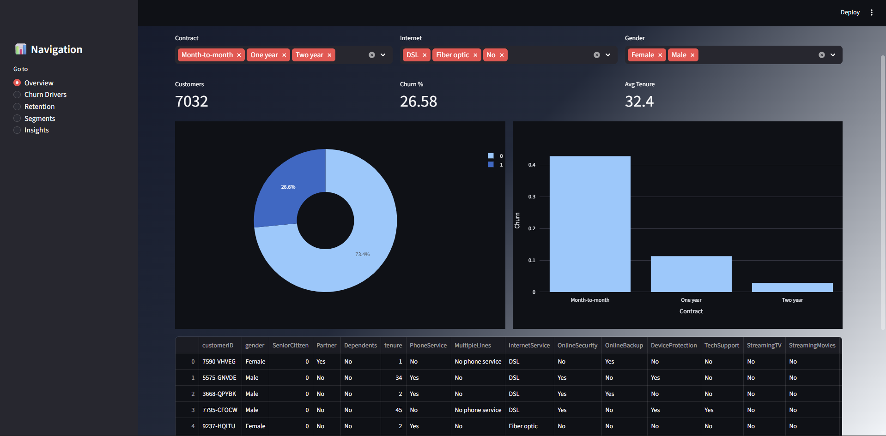
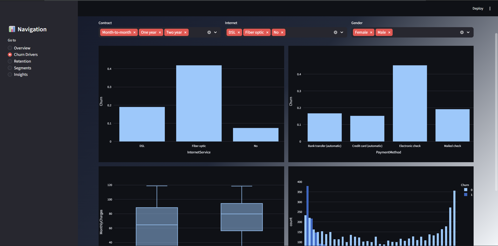
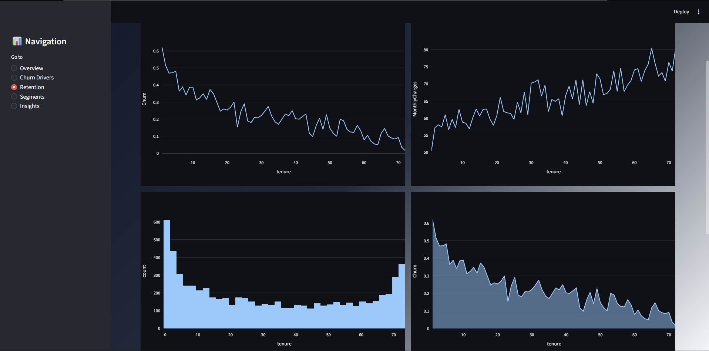
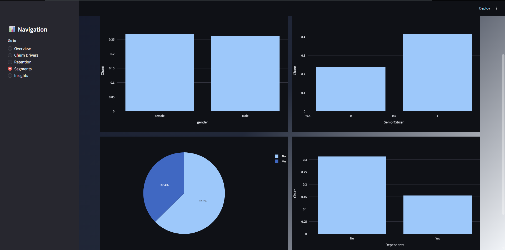
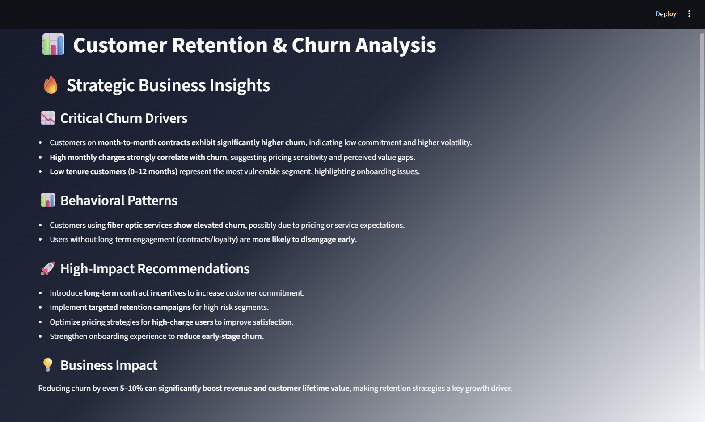

# 📊 Customer Retention & Churn Analysis Dashboard

**Future Interns – Data Science & Analytics Internship · Task 2 · 2026**

### 🖥️ Dashboard Preview

| Overview | Churn Drivers |
|:---:|:---:|
|  |  |

| Retention | Segments |
|:---:|:---:|
|  |  |

| Insights |
|:---:|
|  |

> An interactive dashboard analyzing customer churn patterns, retention behavior, and business strategies to reduce customer loss.

---

## 🚀 Live Dashboard

👉https://futureds002.streamlit.app/

---

## ⚡ Features

- 📊 Multi-page churn analytics dashboard  
- 🔍 Smart filters (Contract, Internet, Gender)  
- 📉 Churn driver analysis  
- 📈 Retention & tenure trends  
- 👥 Customer segmentation insights  
- 💡 Business recommendations  

---

## 📈 Key Metrics

| Metric | Description |
|------|-------------|
| 👥 Customers | Total customers |
| 📉 Churn Rate | % of customers leaving |
| ⏳ Tenure | Customer lifetime |

---

## 🎯 Dashboard Sections

| Section | Description |
|--------|------------|
| 🏠 Overview | KPI + churn distribution |
| 📉 Churn Drivers | Why customers leave |
| 📈 Retention | Tenure & lifetime patterns |
| 👥 Segments | Customer behavior analysis |
| 💡 Insights | Strategic recommendations |

---

## 💡 Key Insights

- 📉 Month-to-month customers have highest churn risk  
- 💰 High monthly charges increase churn probability  
- ⏳ Early-stage customers are most vulnerable  
- 🌐 Fiber optic users show higher churn rates  

---

## 🚀 Business Impact

Improving retention by even **5–10% can significantly increase revenue and customer lifetime value**, making churn analysis critical for business growth.

---

## 🛠️ Tech Stack

- Python  
- Streamlit  
- Pandas  
- Plotly  

---

## ▶️ Run Locally

pip install -r requirements.txt
streamlit run app.py

🚀 Built with passion for Data Analytics · Future Interns 2026

